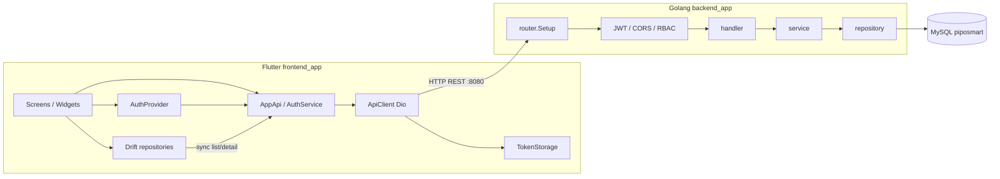

# Piposmart

Aplikasi manajemen laundry (POS / business management) untuk Technical Assessment **Flutter & Golang Developer**.

Frontend Flutter terhubung ke REST API Golang (Gin) dan database MySQL. Fitur utama: autentikasi JWT, dashboard, dan CRUD master data (layanan, outlet, pelanggan, karyawan, pesanan) dengan search, pagination, dan filter.

---

## Teknologi

| Layer | Teknologi |
| --- | --- |
| Frontend | Flutter (stable), Provider, Dio, Flutter Secure Storage, Drift (cache lokal), Google Fonts |
| Backend | Golang, Gin, GORM, JWT (HS256), bcrypt, go-playground/validator |
| Database | MySQL 8.x |
| Dokumentasi API | OpenAPI 3 (`docs/openapi.yaml`), Postman Collection, Markdown |

---

## Prasyarat

- [Flutter] 3.41.6
- [Go] go1.26.6
- [Gin] 1.12.0
- [MySQL]  mysql-8.0.30
- Git

---

## Cara instalasi & menjalankan

### 1. Clone repository

```bash
git clone <url-repo-anda>
cd piposmart
```

### 2. Database

Buat database dan jalankan migration + seeder berurutan:

```bash
mysql -u root -p < database/01_schema_migration.sql
mysql -u root -p < database/02_seed_data.sql
mysql -u root -p < database/03_add_last_login_at.sql
```

Atau lewat MySQL Workbench / CLI: jalankan ketiga file SQL di folder `database/` sesuai urutan nomor.

### 3. Backend

```bash
cd backend_app
copy .env.example .env
# sesuaikan DB_DSN, JWT_SECRET, PORT di .env

go mod download
go run ./cmd/api
```

API default: `http://localhost:8080`  
Health check: `GET http://localhost:8080/health`

### 4. Frontend

```bash
cd frontend_app
flutter pub get
```

Atur base URL di `frontend_app/lib/config/api_config.dart`:

- Android Emulator → `ApiEnvironment.emulator` (`http://10.0.2.2:8080`)
- iOS Simulator → `ApiEnvironment.iosSimulator`
- HP fisik (Wi-Fi sama) → `ApiEnvironment.lan` + isi IP PC di `lanBaseUrl`
- Tunnel → `ApiEnvironment.ngrok` + paste URL ngrok

Lalu jalankan:

```bash
flutter run
```

### Akun demo (seeder)

Password semua user seed: `password123`

| Email | Role |
| --- | --- |
| `reynold@gmail.com` | owner |
| `budi@mewinglaundry.com` | kasir |
| `siti@mewinglaundry.com` | produksi |

---

## Struktur project

```text
piposmart/
├── README.md                          # Dokumentasi utama (file ini)
├── docs/
│   ├── API.md                         # Dokumentasi API (ringkas)
│   ├── openapi.yaml                   # OpenAPI 3 / Swagger
│   ├── postman/
│   │   └── Piposmart.postman_collection.json
│   └── screenshots/                   # Taruh screenshot aplikasi di sini
├── database/
│   ├── 01_schema_migration.sql        # Schema + ERD dalam bentuk SQL
│   ├── 02_seed_data.sql               # Data awal
│   └── 03_add_last_login_at.sql       # Migrasi tambahan
├── backend_app/
│   ├── cmd/api/main.go                # Entry point server
│   ├── .env.example
│   ├── go.mod / go.sum
│   └── internal/
│       ├── config/                    # Env + koneksi MySQL
│       ├── router/                    # Registrasi route Gin
│       ├── middleware/                # JWT, CORS, RBAC, logging
│       ├── handler/                   # HTTP handlers
│       ├── service/                   # Business logic
│       ├── repository/                # Akses database (GORM)
│       ├── model/                     # Entity GORM
│       ├── dto/                       # Request/response + pagination
│       └── pkg/jwt/                   # Generate & parse JWT
└── frontend_app/
    ├── pubspec.yaml
    ├── assets/                        # Icon, gambar, maskot, dll.
    └── lib/
        ├── main.dart                  # App entry + AuthGate
        ├── config/api_config.dart     # Base URL environment
        ├── providers/auth_provider.dart
        ├── services/                  # ApiClient, AuthService, AppApi, TokenStorage
        ├── data/
        │   ├── local/                 # Drift SQLite cache
        │   └── repositories/          # Sync cache ↔ API
        ├── models/
        ├── theme/
        ├── widgets/
        └── screens/
            ├── auth/                  # Login
            ├── dashboard/
            ├── layanan/               # CRUD master (contoh utama)
            ├── outlet/
            ├── pelanggan/
            ├── karyawan/
            ├── pesanan/
            ├── status/
            ├── transactions/
            └── account/               # Profil + logout
```

---

## Alur koneksi (terhubung ke mana)



### Ringkasan mapping

| Bagian Flutter | Terhubung ke | Keterangan |
| --- | --- | --- |
| `api_config.dart` | Base URL backend | Emulator / LAN / ngrok |
| `api_client.dart` | Semua endpoint | Header `Authorization: Bearer <token>` |
| `auth_service.dart` | `/auth/login`, `/auth/me`, `/auth/session` | Login, sesi, logout |
| `app_api.dart` | `/layanan`, `/outlets`, `/pelanggan`, `/karyawan`, `/pesanan`, `/transactions`, `/dashboard/*` | CRUD + dashboard |
| `token_storage.dart` | Secure storage perangkat | Simpan/hapus JWT |
| Repositories Drift | API + SQLite lokal | Cache offline ringan untuk list |
| SQL di `database/` | MySQL | Schema, seed, migrasi |

Backend mengikuti pola: **router → middleware → handler → service → repository → MySQL**.

---

## Fitur utama

1. **Autentikasi** — login email/password, validasi form, JWT, logout (hapus token + kembali ke login)
2. **Dashboard** — nama pengguna, ringkasan keuangan/pesanan, statistik, menu navigasi
3. **CRUD master data** — minimal modul **Layanan** (Create, Read, Update, Delete) + search, pagination, filter; modul lain: Outlet, Pelanggan, Karyawan, Pesanan
4. **Integrasi API** — seluruh data operasional dari backend Golang
5. **Error handling UI** — loading, error, empty state
6. **Security** — JWT, bcrypt, input validation, CORS; RBAC owner untuk `/karyawan`

> Catatan mapping brief assessment: resource contoh `/items` diimplementasikan sebagai **`/layanan`** (master jasa laundry). Login ada di **`POST /auth/login`**.

---

## Database

| File | Isi |
| --- | --- |
| `database/01_schema_migration.sql` | Schema lengkap + FK (bisa dibaca sebagai ERD SQL) |
| `database/02_seed_data.sql` | User, outlet, pelanggan, layanan, pesanan |
| `database/03_add_last_login_at.sql` | Kolom `last_login_at` pada `users` |

### Relasi singkat (ERD)

```text
users ──┬──< user_outlets >── outlets
        │
        └──< pesanan >── pelanggan
               │            │
               │            └── outlets
               └──< pesanan_item >── layanan
```

---

## Dokumentasi API

| File | Kegunaan |
| --- | --- |
| [docs/API.md](docs/API.md) | Referensi endpoint (markdown) |
| [docs/openapi.yaml](docs/openapi.yaml) | OpenAPI 3 — buka di [Swagger Editor](https://editor.swagger.io/) |
| [docs/postman/Piposmart.postman_collection.json](docs/postman/Piposmart.postman_collection.json) | Import ke Postman |

Base URL lokal: `http://localhost:8080`

---

## Screenshot

Lokasi ada di "piposmart\docs\screenshots"

```

---

## Konfigurasi penting

**Backend** (`backend_app/.env`):

```env
PORT=8080
DB_DSN=root:password@tcp(127.0.0.1:3306)/piposmart?charset=utf8mb4&parseTime=True&loc=Local
JWT_SECRET=change-me-to-a-long-random-secret
JWT_EXPIRE_HOURS=24
CORS_ORIGIN=*
```

**Frontend** (`frontend_app/lib/config/api_config.dart`):

```dart
static const ApiEnvironment activeEnvironment = ApiEnvironment.emulator;
```

---

## Lisensi / catatan assessment

Proyek ini dibuat sebagai submission Technical Assessment. UI mengacu referensi Piposmart dengan penyempurnaan arsitektur dan fitur.
